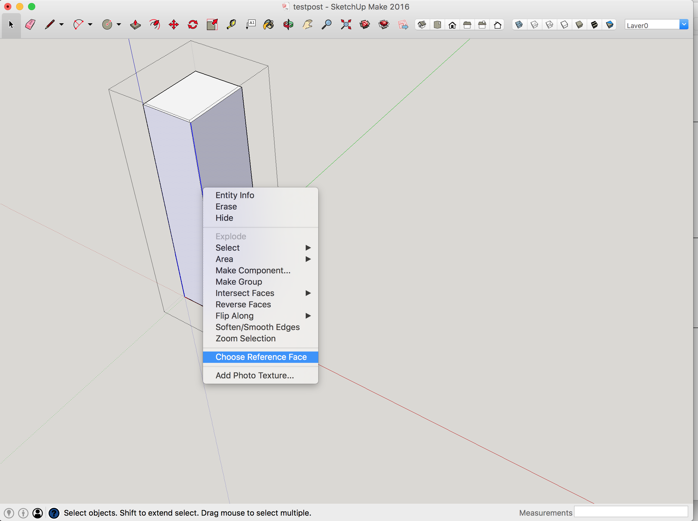

# Choose Reference Face Extension
This extension allows you to identify the selected edge and
face as the arris and reference face of a timber.  This
extension is useful in Timber Framing.

## Use
While in a component, double click on any edge to select the edge and
the two connected faces.  The selected edge becomes the arris.  Use
the context menu and select the "Choose Reference Face" item (if it is
greyed out, you haven't selected exactly one edge with two connected
faces).

Now, move the cursor over one of the two faces and it will be
outlined in red.  You identify the reference face by clicking the left
mouse button while your choice of the two faces is outlined.  A
reference mark (a closed triangle) will be drawn on the reference face
pointing to the arris at a location determined by the cursor position.
Another mark (an open triangle) will be drawn on the adjacent face
pointing to the same location on the arris.

You can click the left mouse button repeatedly to move the
reference marks or change the reference face.  The tool
remains active until another tool is chosen.  If necessary,
you can Undo any and each mark.

Each reference mark is drawn as a separate group and all marks are
placed on a layer named "Reference Marks".
